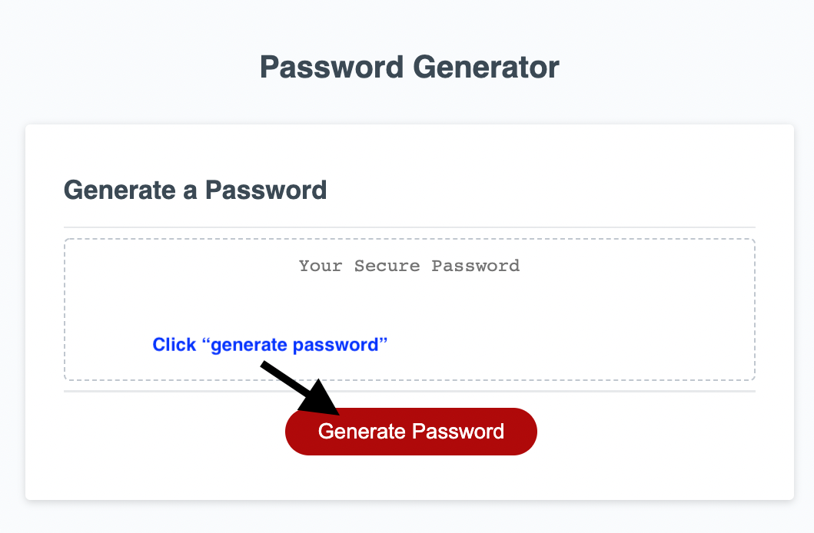
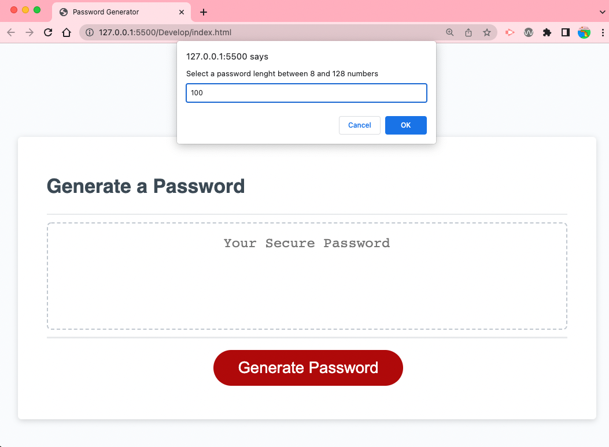

# Password-Generator
This project was a part of a homework assignment. The application uses javascript and focusus on if statments, random generators, and variables to create a random password. 

- My motivation was to learn, and apply what I had learnt in class. To take myself out of HTML & CSS and into the world of javascript for the first time. 
- I built this project as a part of my UWA coding bootcamp. It completed week 3, and our first week of javascript. 
- I solved problems regarding verifying number ranges, merging arrays, converting array's into strings, the use of prompts, allerts, and confirm.

## Installation
To install, download VS code and download file. 

## Usage

Click on the "generate password" button.

Enter number value into confirm box.

Answer prompts - note you must select at least one of the criteria.

## Credits
© 2022 Trilogy Education Services, LLC, a 2U, Inc. brand.

